<h2 align="center">Reiforcement Learning Final Project</h2>

Heyu Sun

519021910914

### 1	Introduction

In model-free Reinforcement Learning, we can implement and solve the problems by value-based and policy-based methods. Some value-based methods such as DQN and DDQN can solve problems with discrete action spaces. Other problems with continuous action space can be solved by policy-based methods such as DDPG and A3C. In this project, we use Atari Games Environment to simulate problems in discrete action spaces and Mujoco Continuous Control Environment to simulate continuous action space problems. 

For value-based methods, I use an algorithm that combines Double-Deep Q-Network(DDQN) and Dueling-Deep Q-Network(Dueling-DQN) together[1]. For policy-based methods, I use Twin Delayed Deep Deterministic policy gradient(TD3).[2]

### 2	Environments

In the project, I use Gym Atari and MuJoCo simulators. 

#### 2.1	Gym Atari Environments

In Atari Environment, I test two environments, one is the BreakoutNoFrameskip-v4, another is PongNoFrameskip-v4. Details can be seen above.

#### 2.2	MuJoCo Continuous Control Environment

In Mujoco environment, I choose Hopper-v2 and Humanoid-v2 to test. The details of the two environments are shown as follows.

### 3	Implementation

#### 3.1	Value-based: Dueling-Double-Deep Q-Network

We have already learned many methods in value-based reinforcement learning. The fundamental method such as DQN is easy to lead to overestimated value estimates and sub-optimal policies. Therefore, there are many advanced DQN versions to overcome it's drawbacks. As we learned before, Double DQN and Dueling DQN, NoisyNet DQN... can be applied. 

I choose Dueling-Double-Deep Q-Network, the visualization of this algorithm is shown below.

It combines Double DQN, prioritized replay and Dueling Network. Based on these three improved methods, it gets a better performance.

**Double DQN** : use current network to select actions and older network to evaluate actions.

**prioritized replay** : store experience in priority queue according to DQN error

**Dueling Network** : use `Q(s, a)=V(s,v)+A(s,a,w)`, replace **Q** with action-independent value function **V** and action-dependent advantage function **A**

Since Double DQN and Dueling DQN focus on different ideas on the modification of DQN, the advantage of them can be combined. In my implementation, I simplify the original network structure to speed up the training process because it's really slow. I modify some parts of it in order to get better performance.

##### Modification 1: 

The Dueling DQN network structure modifies the network. In the original DQN, the output of the network is the Q value which size equals to the size of the action space. In Dueling DQN, two subnetwork structures are added before the output layer, and used to learn value function and advantage function.

Q^π^ (s, a) = V^π^ (s) + A^π^ (s, a) 

In this function, Q is the deterministic action value of the current state, while V indicates whether the current state is good or not, A indicates the degree of action. 

The Implementation of the network can be seen above in the image. The network layer has 3 convolutional layers, the advantage layer and the value layer are both of 2 fully-connected layers.

This is the model's output:[1]

Where θ denotes the parameters of the layers before the output layers, while α and β are the paremeters of the two streams of fully-connected layers.

##### Modification 2:

Double DQN is used to solve the over-estimation problem. The improvement of DDQN is that the action is chosen by a Q, while the value of Q'(s', a') is measured by a target network. Therefore, we can decouple the process of choosing action and calculating Q value.

##### Modification 3:

I use a learning mode to choose action. In first train 50000 steps, we take epsilon = 1, which means we randomly choose actions. Then we decrease epsilon step by step but remains no less than 0.1. This modification is to adjust epsilon to get a better performance with a large possibility to randomly choose actions for training at first and smaller possiblity to choose actions randomly as we get a good model. 

#### 3.2	Policy-based: Twin Delayed Deep Deterministic Policy Gradient

We have already tried A3C and DDPG methods for policy-based problems. In addition to the Actor-Critic and DDPG methods, we also have Proximal Policy Optimization(PPO) and Soft Actor-Critic(SAC). Since SAC is an off-policy algorithm, we choose the optimization of DDPG——TD3 for better performance.

TD3 Pseudo Code

##### Modification 1:

In TD3, we use 6 networks, in which the Critic network becomes two Critic networks. 

DDPG

TD3

In TD3, we use a pair of actors(π~φ1~ , π~φ2~ )and critics(Q~θ1~ , Q~θ2~ ) to form a DQN structure. In order to eliminate the over-estimated problem caused by not entire independence between critics, we take the minimum of the two estimates of Q to update the target network.

##### Modification 2:

We introduce delayed policy updates in TD3. Since the target network can be used to reduce the error over multiple updates, the weights of a target network are either updated periodically to exactly match the weights of the current network, or by some proportion τ at each time step  θ^'^ ← τθ + (1 − τ )θ^'^ .

This update can be applied in an off-policy fashion, sampling random mini-batches of transitions from an experience replay buffer.

##### Modification 3:

In order to reduce the overfit problem caused by deterministic policy, we introduce a regularization strategy of deep value learning to smooth the target policy. While the function approximation does this, the relationship between similar actions can be forced explicitly by modifying the training procedure. We propose that fitting the value of a small area around the target action

would have the benefit of smoothing the value estimate.

##### Modification 4:

In order to have a better view of how the state goes, we import an evaluation method. For 5000 steps, we make an evaluation which reports the average reward over 10 episodes with no exploration noise.

### 4 Result

#### 4.1	Value-based

In value-based situation, I trained 5000000 steps with a learning rate of 0.0001 and batch size of 32. The detail parameters can be seen in my program. 

We can use `python run.py --env_name BreakoutNoFrameskip-v4` to run the value-based condition. The `BreakoutNoFrameskip-v4` can also be changed to other environments.

  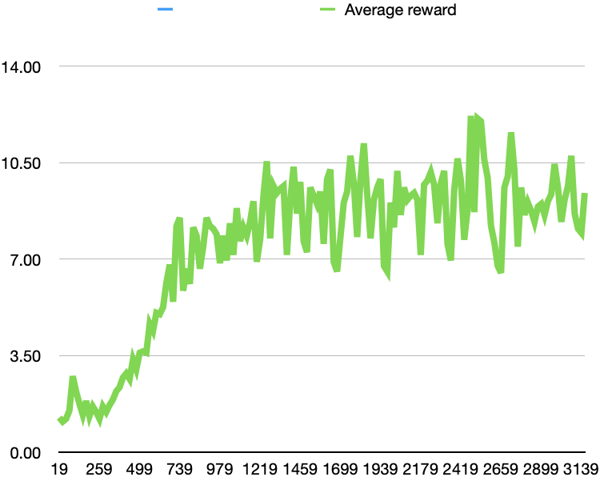
  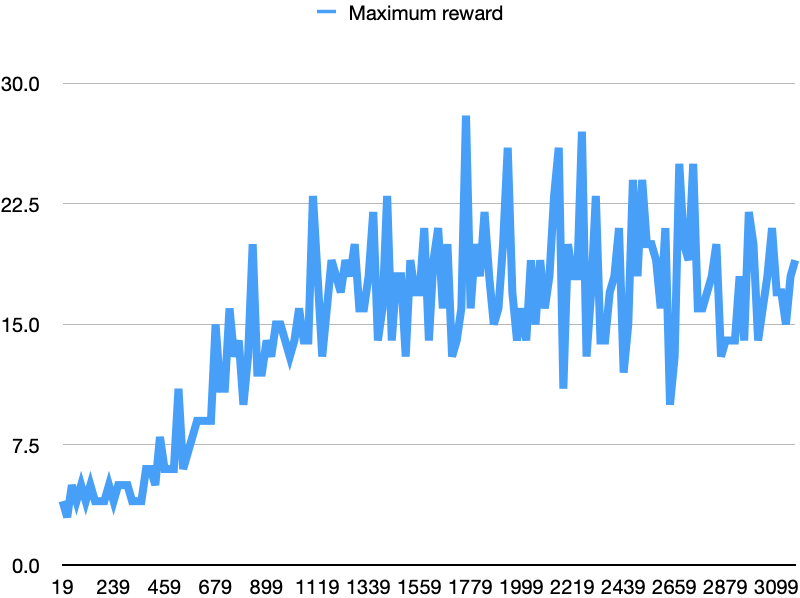

 BreakoutNoFrameskip-v4 

  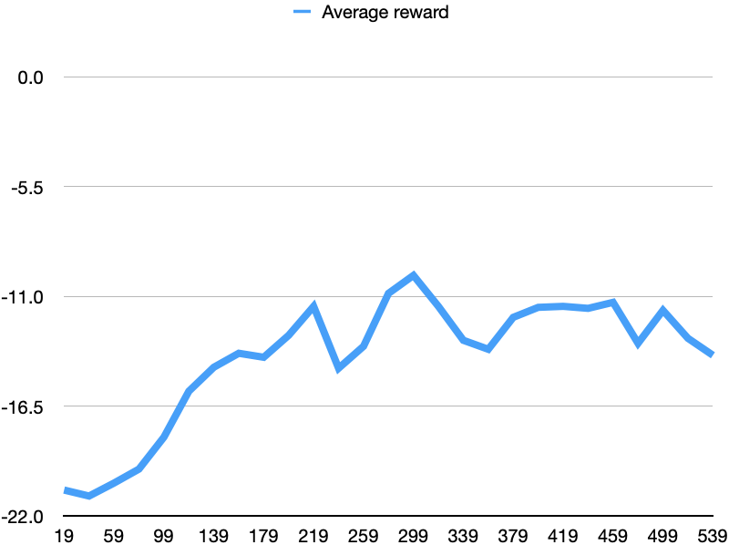
  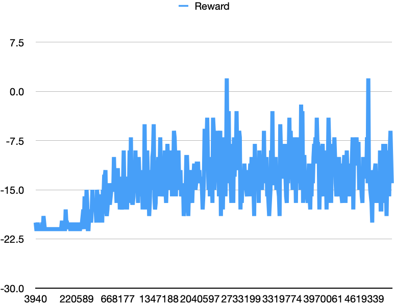

 PongNoFrameskip-v4 

The test on BreakoutNoFrameskip performs better. We can see that the reward becomes better than before, but keeps stable after that. Due to the poor running speed of the value-based algorithm and it's large amount of steps, I redo the `PongNoFrameskip-v4` environment test. I cancelled the learning mode and make the steps to 10000000.

  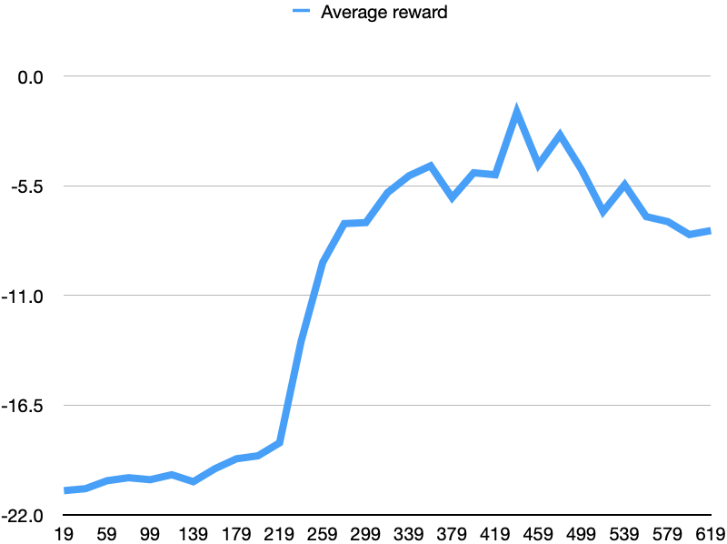
  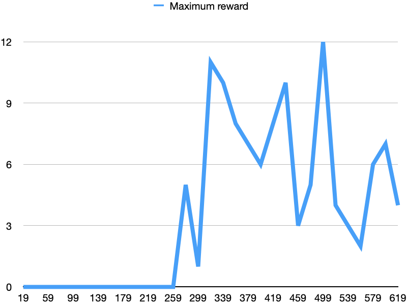

 PongNoFrameskip_new-v4 

The result is better than before. 

#### 4.2	Policy-based

In policy-based situation, I run 1000000 steps with a learning rate 3e-4 and batch size of 256. The detail parameters can be seen in my algorithm.

We can use `python run.py --env_name Hopper-v2` to run the value-based condition. The `Hopper-v2` can also be changed to other environments.

  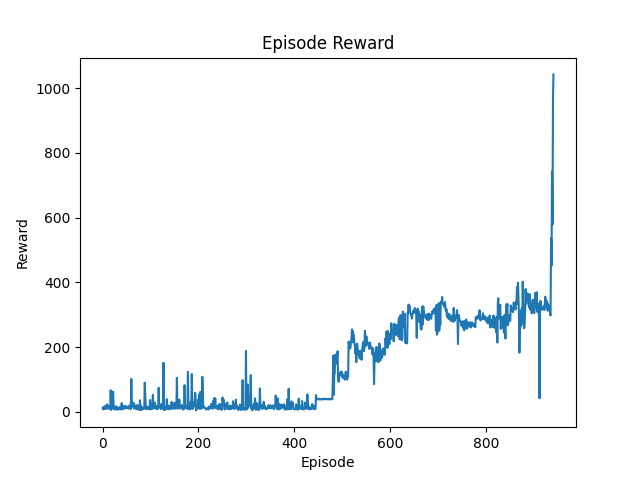
  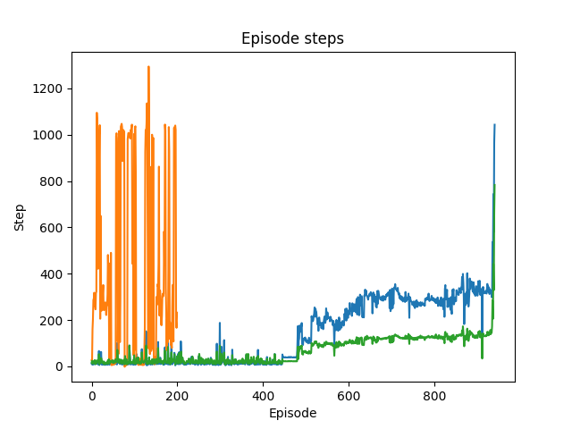
  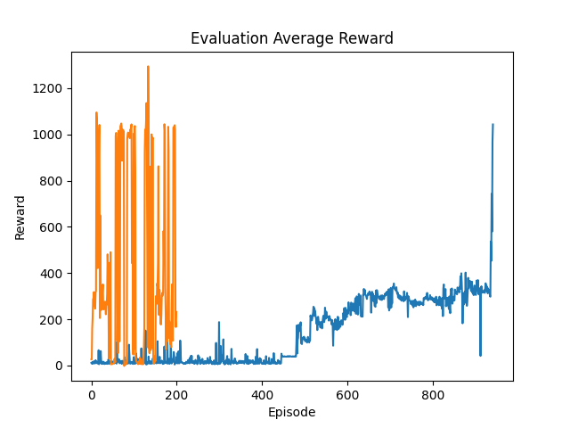

 Hopper-v2 

  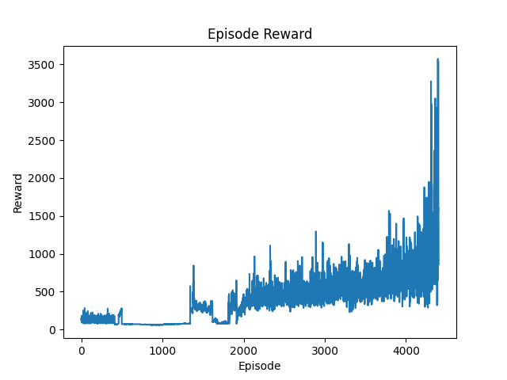
  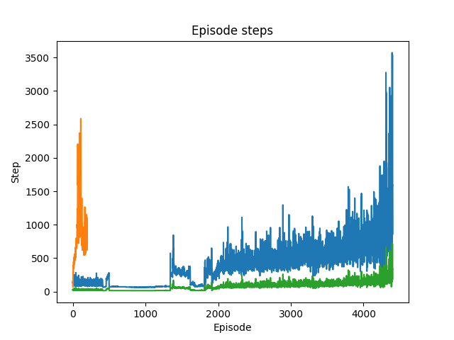
  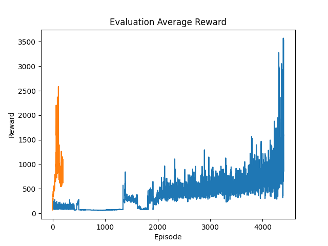

 Humanoid-v2 

I test two environments in policy-based problem. In both environments, the reward show an increasing trend. The average reward evaluated by evaluation process also show a similar trend. After the starting episode, the reward begins to increase and then becomes larger and larger. Both envionments get the maximum reward when we reach the maximum steps.

We also observe that the reward in Humanoid-v2 gets a better result. This may be the training step in Hopper-v2 is still not enough. By anyway, the trend tells that it gets the correct answer.

### 5	Conclusion

In this final project, I do the model-free control experiments which are based on Gym Atari and mujoco to test value-based problems and policy-based problems. In value-based problems, I choose the Dueling-Double-Deep Q-Network, while in policy-based problems I choose TD3 algorithm. Both get the correct answer, though the value-based problem didn't achieve ideal results as expected, maybe the algorithm doesn't learn that well or maybe the parameters I set need to be modified. I feel pity that the value-based problem caused a lot of time to run and I don't have enought time to modify it. In conclusion, I learned a lot from this final project and I hope that I will also get so much in the future learning.

#### References

[1] Research on Adaptive Job Shop Scheduling Problems Based on Dueling Double DQN  https://ieeexplore.ieee.org/stamp/stamp.jsp?tp=&arnumber=9218934

[2] Addressing Function Approximation Error in Actor-Critic Methods  https://arxiv.org/pdf/1802.09477.pdf

[3] https://github.com/openai/atari-py#roms

[4] https://github.com/openai/mujoco-py

